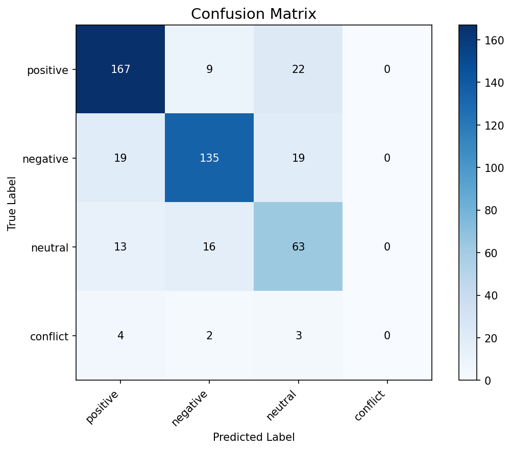
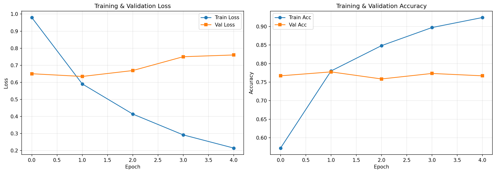
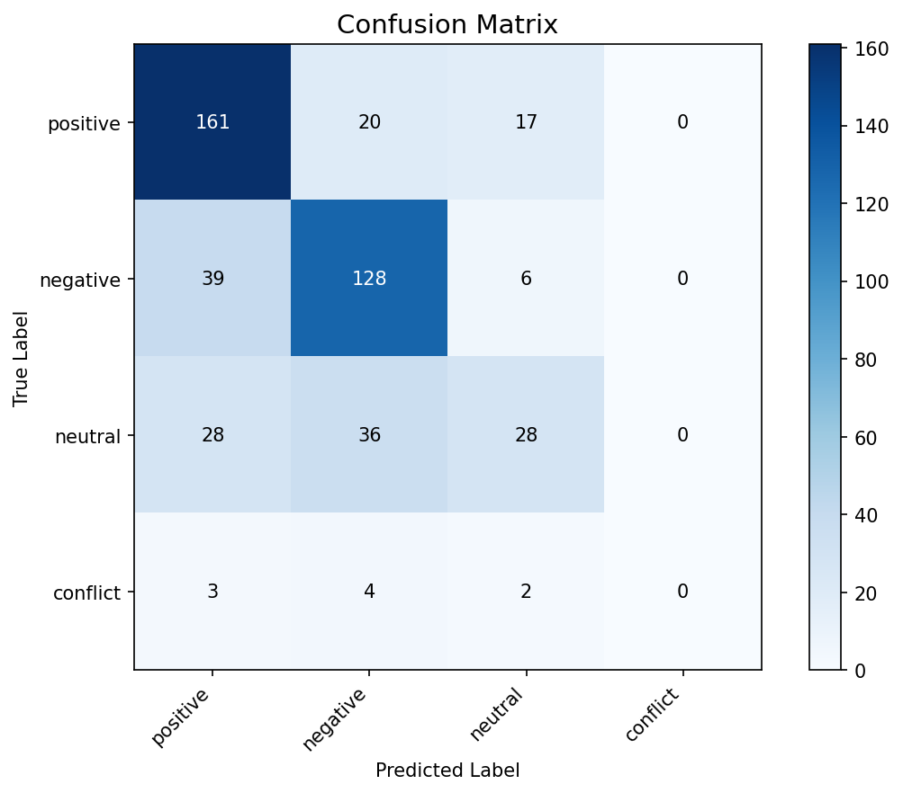
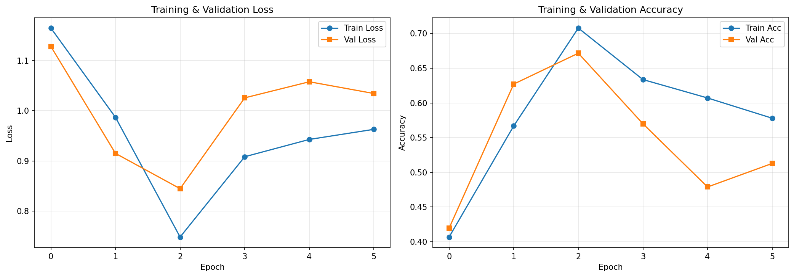
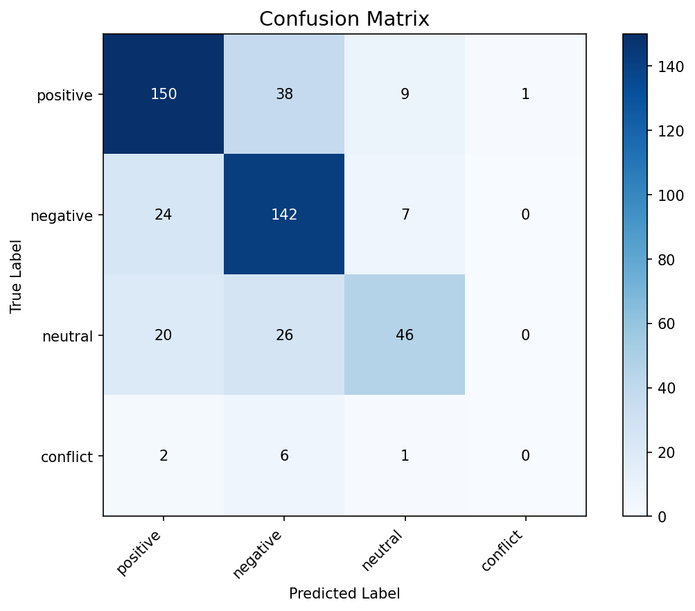

# 🎯 Aspect-Based Sentiment Analysis (ABSA)

A comprehensive comparison of Transformer-based, Deep Learning, and Traditional Machine Learning models for **Aspect-Based Sentiment Analysis** on the SemEval-2014 Task 4 dataset.

---

## 🚀 Project Overview
This project implements and evaluates three distinct architectural approaches to sentiment classification where the sentiment is specific to a particular **aspect** within a sentence (e.g., "The *speed* is great, but the *battery* is poor").

### 🧠 Implemented Models
1.  **BERT (Transformer)**: Leveraging `bert-base-uncased` with a sequence classification head. It processes input as `[CLS] sentence [SEP] aspect [SEP]`.
2.  **LSTM + Attention**: A Bidirectional LSTM architecture using GloVe 300d embeddings and a custom Attention mechanism focused on the aspect term.
3.  **Traditional ML**: Feature engineering using TF-IDF (1-3 n-grams) combined with a local context window around the aspect, evaluated with **SVM** and **Random Forest**.

---

## 📊 Performance Statistics (Laptops Domain)

| Model | Accuracy | Macro F1 | Training Time |
| :--- | :---: | :---: | :---: |
| **BERT** | **77.33%** | **0.568** | ~450s (GPU) |
| **Random Forest** | 71.61% | 0.523 | ~1.2s |
| **SVM (LinearSVC)** | 69.70% | 0.547 | ~0.65s |
| **LSTM + Attention** | 67.16% | 0.461 | ~24s |

---

## 🖼️ Results Visualization

### 1. BERT - Transformer Excellence
BERT achieves the highest accuracy by understanding the deep bidirectional context and the semantic relationship between the aspect and the sentence.

| Confusion Matrix | Training Curves |
| :---: | :---: |
|  |  |

### 2. Deep Learning (LSTM + Attention)
The Bi-LSTM model captures sequential dependencies, while the Attention mechanism helps the model focus on the most relevant words for a given aspect.

| Confusion Matrix | Training Curves |
| :---: | :---: |
|  |  |

### 3. Traditional Machine Learning
Fast and interpretable models using TF-IDF and aspect-proximal features.

| SVM Confusion Matrix | RF Confusion Matrix |
| :---: | :---: |
|  |  |

---

## 🛠️ Setup & Installation

### Prerequisites
- Python 3.8+
- CUDA-enabled GPU (optional, but recommended for BERT)

### Installation
```bash
# Clone the repository
git clone <repo-url>
cd dataset_sentiment

# Install dependencies
pip install -r requirements.txt
```

---

## 💻 Usage

### Training Models
The project provides a unified entry point `main.py` to train models on different domains (Laptops/Restaurants).

```bash
# Train BERT on Laptop dataset
python main.py --model bert --domain laptops

# Train LSTM on Restaurants
python main.py --model lstm --domain restaurants

# Train Traditional models (SVM/RF)
python main.py --model traditional --domain laptops

# Train EVERYTHING (All models, all domains)
python main.py --model all --domain all
```

### Interactive Dashboard
A Flask-based dashboard is included to visualize all results and training logs in a single view.

```bash
python dashboard.py
# Open http://localhost:5000 in your browser
```

---

## 📁 Project Structure

-   `config.py`: Centralized hyperparameters, paths, and device settings.
-   `main.py`: CLI controller for the training pipeline.
-   `dashboard.py`: Web server for performance visualization.
-   `models/`:
    -   `bert_model.py`: BERT-based classifier.
    -   `lstm_model.py`: Bi-LSTM + Attention architecture.
    -   `traditional_model.py`: SVM & Random Forest implementations.
-   `utils/`:
    -   `data_loader.py`: XML/CSV parser and PyTorch Dataset classes.
    -   `helpers.py`: Evaluation metrics, plotting utilities, and training loops.
-   `results/`: Saved models, training graphs, and JSON metrics.

---

## 📑 Acknowledgments
- Dataset: **SemEval-2014 Task 4** (Aspect-Based Sentiment Analysis).
- Embeddings: **GloVe 300d 6B**.
- Model Base: `HuggingFace Transformers`.
